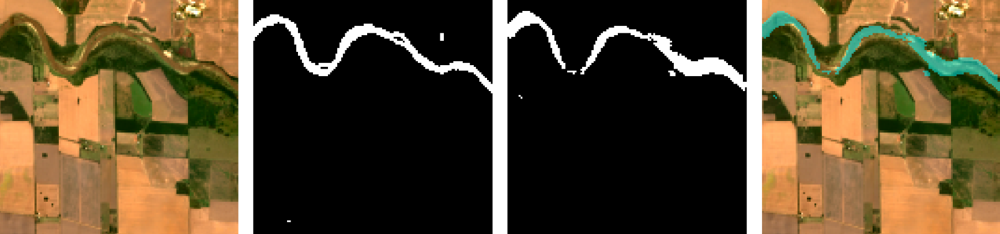
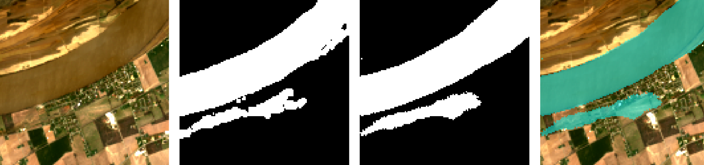

# Water Segmentation with Multispectral Satellite Imagery

This repository contains a comprehensive pipeline for segmenting water bodies from 12-channel multispectral satellite images. The project explores and compares three deep learning architectures: a U-Net built from scratch, a U-Net with a pre-trained ResNet50 encoder, and a fine-tuned version of the ResNet50-U-Net.

The entire project is implemented within a single Google Colab notebook, designed for ease of use and reproducibility with free GPU resources.

## Table of Contents
- [Visual Results](#visual-results)
- [Key Features](#key-features)
- [Model Performance](#model-performance)
- [Project Workflow](#project-workflow)
- [Technical Details](#technical-details)
- [Dependencies](#dependencies)

## Visual Results

The fine-tuned model demonstrates superior performance compared to the baseline U-Net. The images below show a side-by-side comparison of the results from both models. Each image contains four panels: **Input Image**, **Ground Truth Mask**, **Predicted Mask**, and **Prediction Overlay**.

| Model | Full Result Visualization |
| :--- | :--- |
| **U-Net (Baseline)** |  |
| **Fine-Tuned ResNet50** |  |

## Key Features

- **End-to-End Pipeline:** A single notebook covers data loading, cleaning, preprocessing, training, evaluation, and visualization.
- **Multi-Channel Data Handling:** Efficiently processes 12-channel `.tif` satellite images using `tifffile` and a `tf.data` pipeline.
- **Three Model Architectures:**
    1.  **Standard U-Net:** A robust baseline model built from scratch.
    2.  **ResNet50-U-Net:** A transfer learning approach using a pre-trained ResNet50 encoder for powerful feature extraction.
    3.  **Fine-Tuned ResNet50-U-Net:** A two-stage training process to adapt the pre-trained weights to the satellite imagery domain for state-of-the-art results.
- **Data Cleaning:** Includes a script to ensure a one-to-one correspondence between images and masks, preventing training errors.
- **Comprehensive Evaluation:** Models are evaluated using Accuracy, Precision, Recall, and Intersection over Union (IoU).

## Model Performance

Models were evaluated on the validation set using the **Intersection over Union (IoU)** metric. The results clearly show the benefit of transfer learning and fine-tuning.

| Model Architecture | Validation IoU |
| :--- | :---: |
| U-Net (from scratch) | 75.61% |
| ResNet50-U-Net (Feature Extraction) | 75.64% |
| **ResNet50-U-Net (Fine-Tuned)** | **78.27%** |

While the initial transfer learning approach offered a marginal improvement, **fine-tuning the ResNet50 encoder provided a significant 2.6% boost in IoU**, demonstrating its ability to adapt learned features to the specific domain of multispectral satellite imagery.

## Project Workflow

The notebook is structured to guide the user through the entire machine learning lifecycle:

1.  **Load Dataset:** Mounts Google Drive and extracts the zipped dataset.
2.  **Data Preprocessing:**
    -   Counts the initial number of images and masks.
    -   Performs **data cleaning** to remove any orphaned files.
3.  **Data Visualization:** Displays sample images, their NDWI (Normalized Difference Water Index) transformations, and ground truth masks to provide intuition about the data.
4.  **Model Sections:** The notebook contains separate, self-contained sections for each of the three models:
    -   **U-Net**
    -   **Native ResNet50-U-Net**
    -   **Fine-Tuned ResNet50-U-Net**
    Each section includes model definition, compilation, training, and plotting of results.
5.  **Final Evaluation:** After training a model, this section loads the best-saved weights and visualizes predictions on specific test images, comparing them side-by-side with the ground truth.

## Technical Details

### Data Handling Pipeline
Standard Keras data loaders do not support 12-channel TIFF images. This project implements a custom `tf.data` pipeline that uses `tf.py_function` to wrap Python-based libraries (`tifffile` and `Pillow`). This allows for efficient, parallelized loading and preprocessing of the custom data format directly into TensorFlow tensors for GPU training.

### Fine-Tuning Strategy
The successful fine-tuning strategy involves two stages:
1.  **Feature Extraction:** The entire ResNet50 encoder is frozen, and only the randomly initialized decoder is trained. This allows the decoder to learn how to interpret the powerful pre-trained features without corrupting them with large, random gradients.
2.  **Fine-Tuning:** The encoder is unfrozen, but only the later, more specialized layers (e.g., `conv5_block`) are made trainable. The model is then re-compiled with a very low learning rate (`1e-5`) to make small, careful adjustments to the pre-trained weights, adapting them to the new domain.

#
